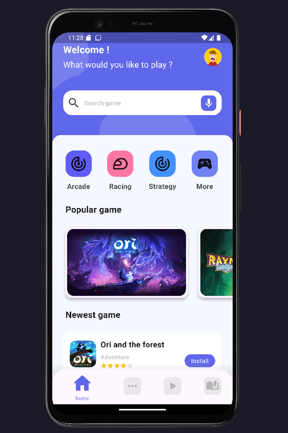
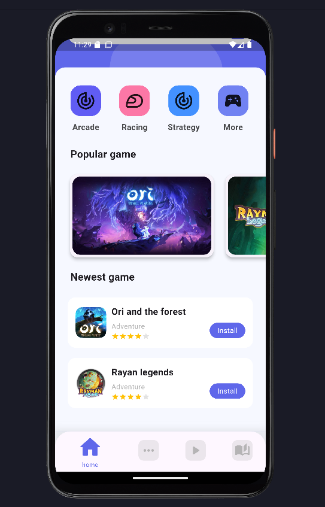

# gamestore

A new Flutter project.

This project is an UI i am doing for game application. The details_page is not finish. I will return to finish it. 
You will see the details screenshot on screenshots directory. Here is the home page.

    

    

